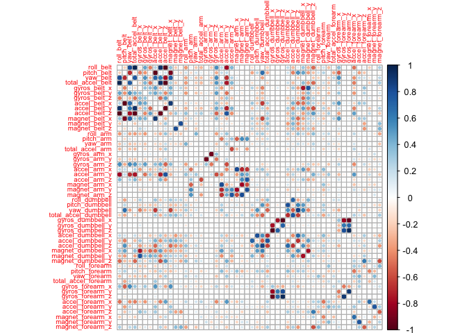
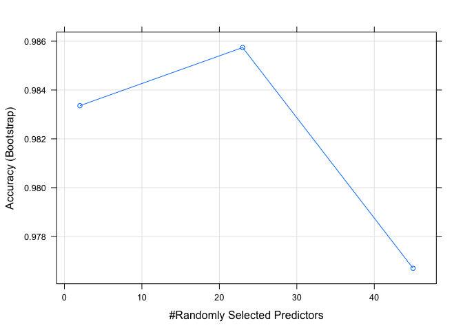
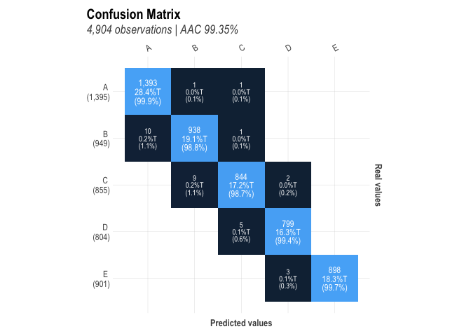
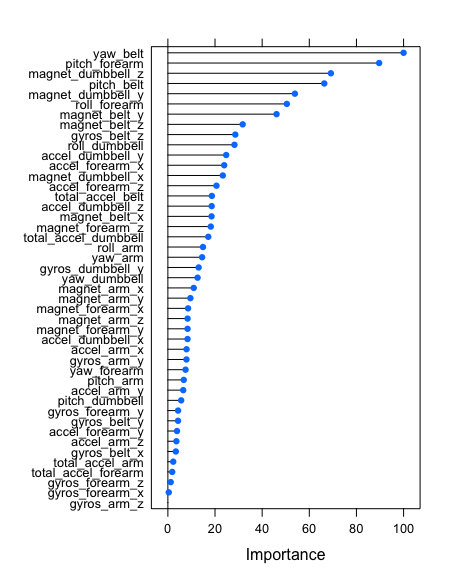
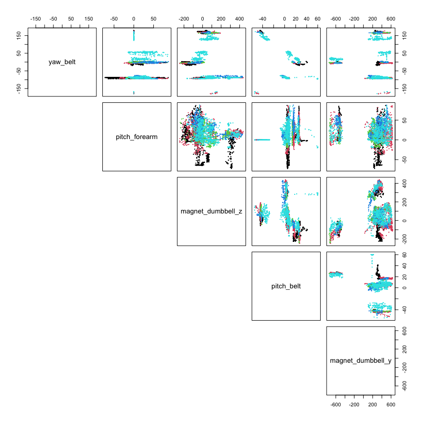

## Introduction

[Velloso et al.](http://web.archive.org/web/20161224072740/http:/groupware.les.inf.puc-rio.br/work.jsf?p1=11201) asked six volunteers to perform barbell lifts (correctly and incorrectly) in 5 different ways. Accelerometer data was collected on the belt, forearm, arm, and dumbell during the exercises. 

This report presents an exploration of machine learning models to predict the manner in which the subjects performed the exercise, including:

* How the models are built and why
* The cross-validation strategy
* An estimation of the expected out of sample error for the selected model
* A prediction using the model of 20 different test cases for which only the accelerometer data is provided

## Data Source

Data from [Velloso et al.](http://web.archive.org/web/20161224072740/http:/groupware.les.inf.puc-rio.br/work.jsf?p1=11201) to build the model was downloaded from: https://d396qusza40orc.cloudfront.net/predmachlearn/pml-training.csv

In this dataset, the manner in which the subjects performed the exercise is coded in the *classe* variable.

Data for which predictions will be performed for the cases downloaded from this location: https://d396qusza40orc.cloudfront.net/predmachlearn/pml-testing.csv

## Packages Used


```r
library(tidyverse)
library(corrplot)
library(caret)
library(lares)
```


## Download and Read the Data

The data to build and cross-validate the model is stored in the *learn* data frame.  Likewise, the 20 test cases to be predicted using the final model are saved into the *evaluate* data frame. 


```r
learnFile <- "training.csv"
learnUrl <- "https://d396qusza40orc.cloudfront.net/predmachlearn/pml-training.csv"
download.file(learnUrl,learnFile)
learn <- as_tibble(read.csv(learnFile))
dim(learn)
```

```
## [1] 19622   160
```

```r
evaluateFile <- "testing.csv"
evaluateUrl <- "https://d396qusza40orc.cloudfront.net/predmachlearn/pml-testing.csv"
download.file(evaluateUrl,evaluateFile)
evaluate <- as_tibble(read.csv(evaluateFile))
dim(evaluate)
```

```
## [1]  20 160
```

## Data Clean-up

The column names are harmonized between the two data sets, NA columns, and columns with no useful information for exercise classification are removed in the code below:


```r
# Find columns named differently in train and test set and make them the same
difNames <- which(names(evaluate)!=names(learn))
cat(paste("Column indices with names that are different:", difNames, "\nWill use names from 'learn' data frame"))
```

```
## Column indices with names that are different: 160 
## Will use names from 'learn' data frame
```

```r
names(evaluate)[difNames] <- names(learn)[difNames]

# Make classe a factor
learn$classe <- factor(learn$classe)
evaluate$classe <- factor(evaluate$classe)

# Eliminate the first 7 columns of both datasets - they contain no useful training data
learn <- learn %>% select(-(1:7))
evaluate <- evaluate %>% select(-(1:7))

# Find columns in the evaluate dataset that contain only NA and remove them
naColumns <- names(which(apply(evaluate,2, function(x) all(is.na(x)))))
useColumns <- names(evaluate)[!(names(evaluate) %in% naColumns)]

evaluate <- evaluate[,useColumns]
learn <- learn[,useColumns]

# Check that no NA's are left in either dataset
if(length(names(which(apply(evaluate,2, function(x) any(is.na(x)))))=="")==0) cat("No NA in 'evaluate'")
```

```
## No NA in 'evaluate'
```

```r
if(length(names(which(apply(learn,2, function(x) any(is.na(x)))))=="")==0) cat("No NA in 'learn'")
```

```
## No NA in 'learn'
```

## Data partitioning

The data is split into *training*, *testing* and *validation* data frames, using *createDataPartition()*:


```r
# Split the learn dataset into a training, a testing and a validation datasets
set.seed(1234)
inBuild <- createDataPartition(learn$classe, p = 3/4)[[1]]
validation <- learn[-inBuild,]
buildData <- learn[inBuild,]

inTrain = createDataPartition(buildData$classe, p = 3/4)[[1]]
training = buildData[ inTrain,]
testing = buildData[-inTrain,]

dim(training)
```

```
## [1] 11040    53
```

```r
dim(testing)
```

```
## [1] 3678   53
```

```r
dim(validation)
```

```
## [1] 4904   53
```

## Dimension Reduction

Near-zero variance columns are eliminated using *nearZeroVar()*, and highly correlated (>90%) columns are identified using *findCorrelation()* and then eliminated:


```r
# Are there columns with near-zero variance in training?  If yes, remove them
nearZeroVariance <- nearZeroVar(training)
if(length(nearZeroVariance)==0) {
        print("No near-zero-variance columns in training")
} else {
        print("Removing near-zero-variance columns:")
        print(nearZeroVariance)
        training <- training[,-nearZeroVariance]
        testing <- testing[,-nearZeroVariance]
        validation <- validation[,-nearZeroVar]
        evaluate <- evaluate[,-nearZeroVariance]
}
```

```
## [1] "No near-zero-variance columns in training"
```

```r
# Are there highly correlated columns?  If yes, remove them
corrM <- cor(select(training, -classe))
diag(corrM)<-0
corrplot(corrM, method="circle",tl.cex=0.6)
```

<!-- -->

```r
highCorr <- findCorrelation(corrM, cutoff = 0.9)
if(length(highCorr)==0) {
        print("No highly correlated columns in 'training'")
} else {
        cat( paste("Removing", length(highCorr), "highly correlated columns:\n"))
        print(names(training)[highCorr])
        training <- training[,-highCorr]
        testing <- testing[,-highCorr]
        validation <- validation[,-highCorr]
        evaluate <- evaluate[,-highCorr]
}
```

```
## Removing 7 highly correlated columns:
## [1] "accel_belt_z"     "roll_belt"        "accel_belt_y"     "accel_belt_x"    
## [5] "gyros_dumbbell_x" "gyros_dumbbell_z" "gyros_arm_x"
```

```r
dim(training)
```

```
## [1] 11040    46
```

```r
dim(testing)
```

```
## [1] 3678   46
```

```r
dim(validation)
```

```
## [1] 4904   46
```

## Model Creation

Five different models are created using the *training* dataset. Default values for *trainControl()* are used: 25 bootstrap resamples of the training data (with replacement) and parameter tuning for each of the modeling approaches (for example, *mtry* for Random Forest):


```r
# Build five models
trainctrl <- trainControl(verboseIter = FALSE) #Toggle to TRUE to monitor iterations

modelRF <- train(classe~., method="rf", data=training, trControl=trainctrl) #Random Forest
modelGBM <- train(classe~., method="gbm", data=training, verbose=FALSE, trControl=trainctrl) #Gradient Boosting Machine
modelRPART <- train(classe~., method="rpart", data=training, trControl=trainctrl) #CART
modelTreebag <- train(classe~., method="treebag", data=training, trControl=trainctrl) #Bagged CART
modelLDA <- train(classe~., method="lda", data=training, trControl=trainctrl) #Linear Discriminant Analysis
```

## Model Evaluation against *Testing* Set


```r
# Evaluate the models
predRF <- predict(modelRF, testing); cmRF <- confusionMatrix(predRF,testing$classe)
predGBM <- predict(modelGBM, testing); cmGBM <- confusionMatrix(predGBM,testing$classe)
predRPART <- predict(modelRPART, testing); cmRPART <- confusionMatrix(predRPART,testing$classe)
predTreebag <- predict(modelTreebag, testing); cmTreebag <- confusionMatrix(predTreebag,testing$classe)
predLDA <- predict(modelLDA, testing); cmLDA <- confusionMatrix(predLDA,testing$classe)

accuracy <- data.frame(Random_Forest=cmRF$overall[1], Gradient_Boost=cmGBM$overall[1],
                      CART=cmRPART$overall[1], Tree_Bag=cmTreebag$overall[1],
                      LDA=cmLDA$overall[1])
knitr::kable(accuracy, "html", 
                       col.names=c("Random Forest","Gradient Boost","CART",
                                   "Tree with Bagging","LDA"),
                       align=c("c","c","c","c","c")) %>% 
        kableExtra::kable_styling(bootstrap_options = c("hover"), 
                                  full_width = F, position="center")
```

<table class="table table-hover" style="width: auto !important; margin-left: auto; margin-right: auto;">
 <thead>
  <tr>
   <th style="text-align:left;">   </th>
   <th style="text-align:center;"> Random Forest </th>
   <th style="text-align:center;"> Gradient Boost </th>
   <th style="text-align:center;"> CART </th>
   <th style="text-align:center;"> Tree with Bagging </th>
   <th style="text-align:center;"> LDA </th>
  </tr>
 </thead>
<tbody>
  <tr>
   <td style="text-align:left;"> Accuracy </td>
   <td style="text-align:center;"> 0.9921153 </td>
   <td style="text-align:center;"> 0.9611202 </td>
   <td style="text-align:center;"> 0.5002719 </td>
   <td style="text-align:center;"> 0.9820555 </td>
   <td style="text-align:center;"> 0.6791735 </td>
  </tr>
</tbody>
</table>

Given the complexity of the data, it is not surprising that "simple" classifiers, such as CART (Classification and Regression Trees) and LDA (Linear Discriminant Analysis) perform poorly.  They are thus, dropped out from further consideration.

On the other hand, more complex classifiers perform quite well, all with accuracy > 95%.

## Stacked Model Creation

A stacked model can be created using using the testing data and the predictions of the above Random Forest, Gradient Boost and Tree with Bagging models:


```r
predDataFrame <- data.frame(predRF, 
                            predGBM, 
                            predTreebag, 
                            classe=testing$classe)
modelCombined <- train(classe~.,model="rf", data=predDataFrame,trControl=trainctrl)
```

## Model Evaluation against the *Validation* Set

The stacked model and its three parent models are evaluated against the *validation* data set:


```r
# Evaluate on the validation dataset
vpredRF <- predict(modelRF, validation); vcmRF <- confusionMatrix(vpredRF,validation$classe)
vpredGBM <- predict(modelGBM, validation); vcmGBM <- confusionMatrix(vpredGBM,validation$classe)
vpredTreebag <- predict(modelTreebag, validation); vcmTreebag <- confusionMatrix(vpredTreebag,validation$classe)

vpredDataFrame <- data.frame(predRF=vpredRF,
                             predGBM=vpredGBM,
                             predTreebag=vpredTreebag)
vpredCombined <- predict(modelCombined,vpredDataFrame); vcmCombined <- confusionMatrix(vpredCombined,validation$classe)

vaccuracy <- data.frame(Random_Forest=vcmRF$overall[1], Gradient_Boost=vcmGBM$overall[1],
                     Tree_Bag=vcmTreebag$overall[1],
                      Stacked=vcmCombined$overall[1])
knitr::kable(vaccuracy, "html", 
                       col.names=c("Random Forest","Gradient Boost",
                                   "Tree with Bagging","Stacked"),
                       align=c("c","c","c","c","c")) %>% 
        kableExtra::kable_styling(bootstrap_options = c("hover"), 
                                  full_width = F, position="center")
```

<table class="table table-hover" style="width: auto !important; margin-left: auto; margin-right: auto;">
 <thead>
  <tr>
   <th style="text-align:left;">   </th>
   <th style="text-align:center;"> Random Forest </th>
   <th style="text-align:center;"> Gradient Boost </th>
   <th style="text-align:center;"> Tree with Bagging </th>
   <th style="text-align:center;"> Stacked </th>
  </tr>
 </thead>
<tbody>
  <tr>
   <td style="text-align:left;"> Accuracy </td>
   <td style="text-align:center;"> 0.9934747 </td>
   <td style="text-align:center;"> 0.9588091 </td>
   <td style="text-align:center;"> 0.9881729 </td>
   <td style="text-align:center;"> 0.9932708 </td>
  </tr>
</tbody>
</table>

The stacked model's performace does not improve upon that of the Random Forest parent model.

## Model Selection and Predictions

Based on the above results, the Random Forest model is selected to be used to predict the manner in which the subjects performed the exercise for the 20 unknown test cases.


```r
epredRF <- predict(modelRF, evaluate)
predictions <- as.data.frame(matrix(nrow=1,ncol=20))
predictions[1,] <- epredRF
names(predictions) <- 1:20
knitr::kable(predictions, "html", align=rep("c",times=20)) %>% 
        kableExtra::kable_styling(bootstrap_options = c("hover"), 
                                  full_width = F, position="center")
```

<table class="table table-hover" style="width: auto !important; margin-left: auto; margin-right: auto;">
 <thead>
  <tr>
   <th style="text-align:center;"> 1 </th>
   <th style="text-align:center;"> 2 </th>
   <th style="text-align:center;"> 3 </th>
   <th style="text-align:center;"> 4 </th>
   <th style="text-align:center;"> 5 </th>
   <th style="text-align:center;"> 6 </th>
   <th style="text-align:center;"> 7 </th>
   <th style="text-align:center;"> 8 </th>
   <th style="text-align:center;"> 9 </th>
   <th style="text-align:center;"> 10 </th>
   <th style="text-align:center;"> 11 </th>
   <th style="text-align:center;"> 12 </th>
   <th style="text-align:center;"> 13 </th>
   <th style="text-align:center;"> 14 </th>
   <th style="text-align:center;"> 15 </th>
   <th style="text-align:center;"> 16 </th>
   <th style="text-align:center;"> 17 </th>
   <th style="text-align:center;"> 18 </th>
   <th style="text-align:center;"> 19 </th>
   <th style="text-align:center;"> 20 </th>
  </tr>
 </thead>
<tbody>
  <tr>
   <td style="text-align:center;"> B </td>
   <td style="text-align:center;"> A </td>
   <td style="text-align:center;"> B </td>
   <td style="text-align:center;"> A </td>
   <td style="text-align:center;"> A </td>
   <td style="text-align:center;"> E </td>
   <td style="text-align:center;"> D </td>
   <td style="text-align:center;"> B </td>
   <td style="text-align:center;"> A </td>
   <td style="text-align:center;"> A </td>
   <td style="text-align:center;"> B </td>
   <td style="text-align:center;"> C </td>
   <td style="text-align:center;"> B </td>
   <td style="text-align:center;"> A </td>
   <td style="text-align:center;"> E </td>
   <td style="text-align:center;"> E </td>
   <td style="text-align:center;"> A </td>
   <td style="text-align:center;"> B </td>
   <td style="text-align:center;"> B </td>
   <td style="text-align:center;"> B </td>
  </tr>
</tbody>
</table>

## Random Forest Model Assessment - Out of Sample Error

As mentioned earlier, the Random Forest model was created using 25 bootstrap resamples of the training dataset. For each resample, three *mtry* values were evaluated. The *mtry* parameter value determines the number of variables available for splitting at each tree node in the forest; maximum accuracy was achieved with *mtry*=23 for the *training* dataset.


```r
plot(modelRF)
```



The confusion matrix for the Random Forest model applied to the *validation* dataset is shown below. The model has excellent sensitivity/specificity for every one manners the exercise was performed by the subjects.


```r
 mplot_conf(validation$classe,vpredRF)
```



According to [Kuhn](https://topepo.github.io/caret/variable-importance.html), the *varImp()* function tracks the changes in model statistics for each predictor and accumulates the reduction in the statistic when each predictor’s feature is added to the model . This total reduction is used as the variable importance measure. For the training dataset, the relative variable importance is shown below.


```r
vImp <- varImp(modelRF)
plot(vImp)
```



Below, the scatter-plot matrix for the top five variables identified by *varImp()* is presented:


```r
vImpDF<-vImp$importance; top5 <- rownames(vImpDF)[order(-vImpDF$Overall)][1:5]; reducedVal <- validation[,top5]
par(mfrow=c(1,1)); pairs(reducedVal, pch=19,cex=0.2, col=validation$classe, lower.panel=NULL)
```



## Conclusion

Five classification approaches were considered to model rhe training data from [Velloso et al.](http://web.archive.org/web/20161224072740/http:/groupware.les.inf.puc-rio.br/work.jsf?p1=11201) after dimensionality was reduced based on high variable correlation. 

Based on accuracy, the simpler classifier approaches: CART and LDA, performed poorly.  More complex approaches: Random Forest, Gradient Boosting and Tree Bagging, performed very well. This may be attributed to the complex data clustering observed in the scatter-plot matrix. 

Random Forest was selected as the preferred modeling approach, its out-of-sample error was assessed against the validation dataset, and predictions were made for 20 unknown cases.

